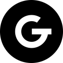

# Safe

**Safe** enables sharing **confidential information** with a limited **number of views** and **overall lifetime**.

## Features

🕸️ _Web Native_ frontend build with pure **HTML**, **CSS** and **JS**.  
🪶 _Simple_ and _lightweight_ single-file backend with **Bun**.  
🔏 _Fast_ and _secure_ data management with **Redis**.

## A (Very) Quick Start

Deploy the app in a Docker Compose stack with (non-persistent) **Redis** and (reverse proxy) **NGINX**.

Once deployed, open the app, input the data, stash it and share the generated **Safe** link as needed.

## Additional Resources

[**Bun**](https://bun.sh) documentation is available [here](https://bun.sh/docs).

[**Redis**](https://redis.io) documentation is available [here](https://redis.io/docs).

[**Docker**](https://www.docker.com) documentation is available [here](https://docs.docker.com).

[**NGINX**](https://www.nginx.com) documentation is available [here](https://nginx.org/en/docs/).

## License

**Safe** is released under the MIT license. See [LICENSE.md](./LICENSE.md) for details.